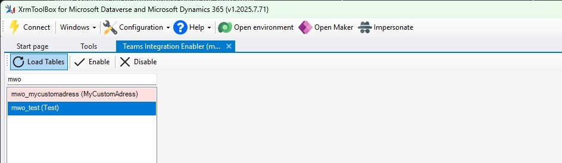
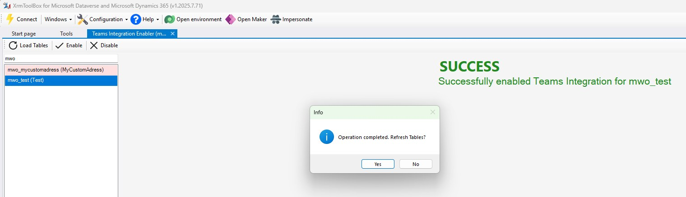
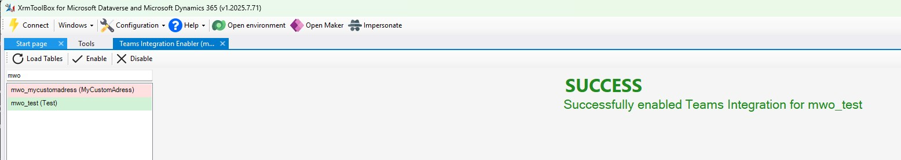

# TeamsIntegrationEnabler
In the _Sales Hub_ App, _App Settings_, _Chat and Collaborate_, you will find the option to _Turn on linking of Dynamics 365 records to Microsoft Teams channels_. While the 3 switch interface of this section is easy to use, it will only enable this feature for [a fixed set of tables](https://learn.microsoft.com/en-us/dynamics365/sales/teams-integration/teams-collaboration#record-types-that-support-microsoft-teams-integration).

You can disable these preset tables as well as enable it for custom tables and many OOTB tables [with Web API requests](https://learn.microsoft.com/en-us/dynamics365/customerengagement/on-premises/developer/integration-dev/teams-integration-using-code). Since this requires extra tools and additional preparation time, this tool shall help you to perform these actions more easily.

## Prerequisites
- You need to have the solution `msdynce_OfficeProductivity` installed in your environment. This solution seems to be preinstalled if either Customer Service, Sales or Marketing apps are installed. 
- Make sure to turn on _Turn on linking of Dynamics 365 records to Microsoft Teams channels_, for example in _Sales Hub_ App, _App Settings_, _Chat and Collaborate_. This will ensure the feature itself is active as well as enabled the standard set of tables.

## Step by step
1. Load the tables and find the table you are looking to enable/disable. There is a search box at the top to help you.

1. Now use the _Enable/Disable_ buttons to change the status of the Teams Integration for the given table.

1. After reloading, the colorcoding will show you the current status of the feature. (**Please check the know issues section!**)

1. If you chose to enable the Teams Feature for a table and as a whole in _Chat and Collaborate_ you should now find the _Collaborate_ button in the ribbon of a form for existing records of that table. If you don't, make sure to use clear cache refresh, Publish all Customization and Regenerate Ribbon Metadata; as usual the ribbon might be stubborn to update its contents.
1. If you have the table in question in a solution with _Include table metadata_ enabled, the status of the Teams Integration will be transported to other environments with the solution. 

## Known issues
- The `msdyn_SetTeamsDocumentStatus` action reports success before the new status is reflected in metadata, this can lead to tables still showing a wrong status after the refresh. Testing showed that the metadata will correct within one minute, use the _Load Tables_ button to refresh it.
- The `msdyn_SetTeamsDocumentStatus` action reports success for all(?) tables, even for uncustomizable tables like `activityparty`. Since the action reports success, so will this tool, however those tables will never change their teams feature status no matter how often you use _Load Tables_.
